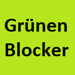

Languages:
 -
 -
 -
 -
 -

# Grünen Content Blocker

Der digitale Grünen Blocker **blockiert Inhalte über Bündnis 90/Die Grünen und Konsorten** zuverlässig.

Neu!

Optional blockiert das Browser-Plugin auch Inhalte über andere Parteien.

Verwende den Grünen Blocker. Er ist viel besser als der [AfD-Blocker von Die PARTEI](https://github.com/dieparteidiepartei/afd-blocker-plugin)!

# Features

- verfügbar für FireFox und Google Chrome,
- verfügbar in verschiedenen Sprachen (derzeit Deutsch, Englisch, Französisch, Türkisch und Spanisch),
- blockiert Inhalte über Bündnis 90/Die Grünen,
- blockiert optional Inhalte über deutsche Parteien: SPD, Die Linke, CDU, CSU oder FDP,
- blockiert optional Inhalte über französische Parteien: LaREM, LR, FI, PS oder EELV,
- blockiert optional Inhalte über türkische Parteien: AKP, CHP, HDP, MHP oder İYİ Parti,
- blockiert optional Inhalte über spanische Parteien: PSOE, PP, Cuidadanos, Unidos/Unidas Podemos (UP) oder VOX,
- funktioniert mit so gut wie allen bekannten Social Media Portalen, Suchmaschinen und Nachrichten-Seiten:

Facebook, Instagram, Twitter, Youtube und Izlesene. DuckDuckGo, Startpage, Qwant und Yandex. Bild, FAZ, Focus, Handelsblatt, Hessische/Niedersächsische Allgemeine, Morgenpost, N-TV, Nürnberger Nachrichten und Zeitung, Spiegel, Stern, Stuttgarter Zeitung, Süddeutsche Zeitung, Tagesschau, Tagesspiegel, TAZ, ZDF, Die Zeit, und viele weitere.

# Downloads

- [Chrome Extension](https://chrome.google.com/webstore/detail/gr%C3%BCnen-blocker/hhpcjimcpbbihmamgphcafoeohhblmpo)
- [Firefox Add-on (Deutsch)](https://addons.mozilla.org/de/firefox/addon/gr%C3%BCnen-content-blocker/)
- [Firefox Add-on (Englisch)](https://addons.mozilla.org/en-US/firefox/addon/gr%C3%BCnen-content-blocker/)
- [Firefox Add-on (Französisch)](https://addons.mozilla.org/fr/firefox/addon/gr%C3%BCnen-content-blocker/)
- [Firefox Add-on (Spanisch)](https://addons.mozilla.org/es/firefox/addon/gr%C3%BCnen-content-blocker/)
- [Firefox Add-on (Türkisch)](https://addons.mozilla.org/tr/firefox/addon/gr%C3%BCnen-content-blocker/)

# Entwickler

## Installation der erforderlichen Module

Installiere [Node.js](https://nodejs.org/de/) und führe das `install` Kommando aus dem Projektverzeichnis aus.

	 npm install

## Umgebungen

Das Build-Tool setzt die Variable `process.env.NODE_ENV` in den Skriptdateien.

### Build prod stage (./packages/)

    npm run build chrome
    npm run build firefox
    npm run build opera
    npm run build edge

### Build test stage (./dist/)

    npm run dev chrome
    npm run dev firefox
    npm run dev opera
    npm run dev edge

## Los geht's

### Einen Blocker für eine neue Domain hinzufügen

Das Skript `app/scripts/blocker.js` implementiert die Funktionalität.

Die Blocker-Konfigurationen für spezifische Domains befinden sich unterhalb von `app/scripts`, initialisieren je einen Blocker und führen ihn aus.

Kopiere eine Blocker-Konfigruation um einen Blocker für Deine Domain zu implementieren. Zum Beispiel `app/scripts/blocker_sueddeutsche.js`:

		console.log("Call content blocker.");
		
		import { Blocker } from "./blocker";
		
		new Blocker([
		    {
		        selector: 'li.element',
		        type: 'big'
		    },
		    {
		        selector: '.sz-teaserlist-element',
		        type: 'big'
		    },
		    {
		        selector: 'li.newsscannermodule__item',
		    },
		    {
		        selector: 'article',
		        type: 'big'
		    },
		    {
		        selector: 'div.entrylist__entry',
		        type: 'big'
		    },
		]).run();

Nach der Konfiguration Deines Blockers musst Du ihn für Deine Domain in der Manifest-Datei `app/manifest.json` registrieren:

      "content_scripts": [
        {
          "matches": [
            "*://*.sueddeutsche.de/*"
          ],
          "js": [
            "scripts/blocker_sueddeutsche.js"
          ],
          "css": [
            "css/overlay.css"
          ]
        },
        ...
      ]

### Zu blockierende Inhalte einfügen.

tbd.

### Fehlerbehebung

tbd.

### Webextension toolbox Dokumentation

* [webextension-toolbox](https://github.com/HaNdTriX/webextension-toolbox)
